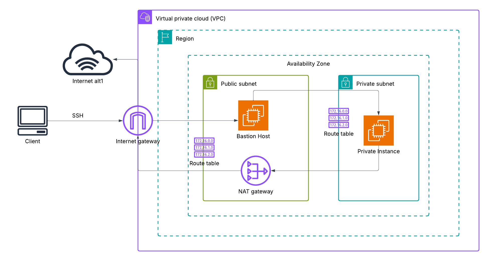

# Secure AWS NAT-Bastion Architecture

This repository demonstrates a secure network setup on AWS using a Virtual Private Cloud (VPC) with a public subnet (with Bastion and NAT Gateway) and private subnet (with isolated EC2 instance). Secure access is enabled via a bastion host while allowing outbound internet access for updates.

## 📌 Solution Architecture

## Key Features
- Secure Bastion Host in public subnet for SSH access to private workloads
- Private subnet with NAT Gateway for outbound-only internet access
- VPC and subnet architecture that isolates private instances from direct inbound internet access

## Contents
- `Architecture-Description.md`: Design rationale and detailed components
- `Setup-Instructions.md`: Step-by-step guide for deployment
